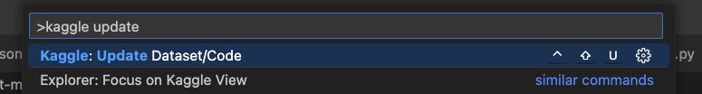
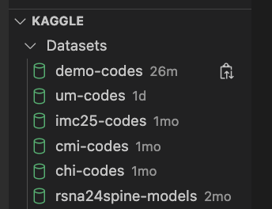
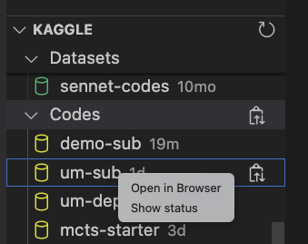
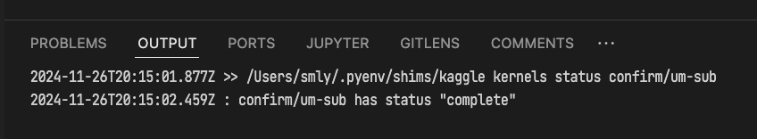
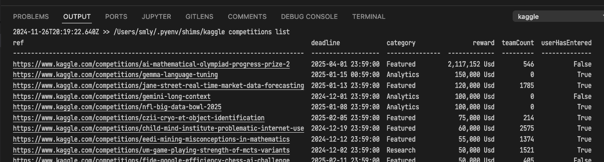

<a href="https://marketplace.visualstudio.com/items?itemName=smly.fastkaggle">
  
</a>

# Kaggle Extension for VS Code

[](https://marketplace.visualstudio.com/items?itemName=smly.fastkaggle)

Simplify your Kaggle workflow: Update and manage datasets and kernels directly within VS Code.

## How to use

This extension uses the `kaggle` command line tool to interact with Kaggle.
You need to have the [Kaggle CLI](https://github.com/Kaggle/kaggle-api) installed on your machine.

```bash
$ pip install kaggle
```

If the path to the `kaggle` command is in the PATH of the shell, you can use this extension without any settings. You can specify the path to the `kaggle` executable in the `settings.json`. For example:

```diff
+    "fastkaggle.executablePath": "/path/to/executable/kaggle"
```

## Features

### Commands: Update Datasets or Codes



**Usage**: `Cmd+Shift+P` to open the command palette and select "Kaggle: Update Dataset/Code".
Or use the shortcut key `Ctrl+Shift+U`.

This command search for the `dataset-metadata.json` or `kernel-metadata.json` file in the directory where the currently open file is located or in the parent directory, set that directory as the current directory, and execute the update command.

### Sidebar View for Datasets, Codes and Models

The extension provides a sidebar view for datasets, codes and models.



Right-click to open the context menu and check the status of the Dataset or Code.



The status of the dataset or code is displayed based on the result of the status sub-command.



### Commands: List Competitions

List recent competitions in order of deadline. `kaggle competitions list` is executed and the output is displayed.



**Enjoy!**
