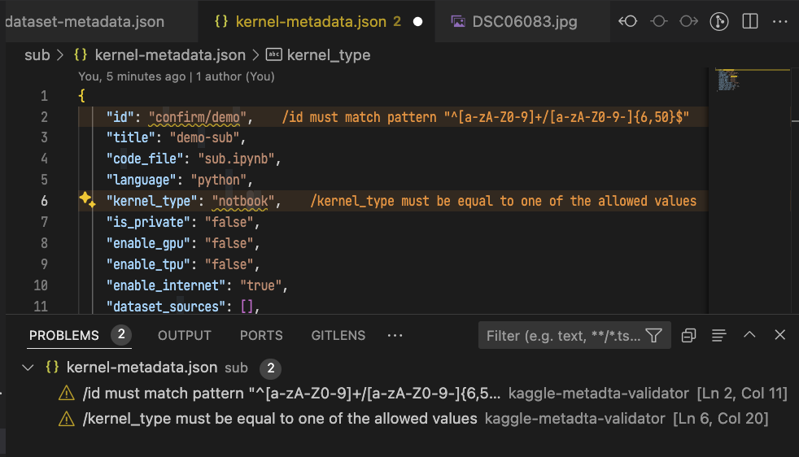

# VS Code Extension for Kaggle

Simplify your Kaggle workflow: Update and manage datasets and kernels directly within VS Code.

## Prerequisites

This extension leverages the `kaggle` command-line tool for interacting with Kaggle. You'll need to have the [Kaggle CLI](https://github.com/Kaggle/kaggle-api) installed and configured on your machine.

### Extension Settings

This extension contributes the following setting:

* `fastkaggle.executablePath`: Path to the `kaggle` executable. If the `kaggle` command is in your system's PATH, you can use this extension without modifying this setting.

## Features

### Update Datasets and Notebooks

* **Shortcut**: <kbd>Ctrl</kbd>+<kbd>Shift</kbd>+<kbd>U</kbd>.
* **Command Palette**: <kbd>Cmd</kbd>+<kbd>Shift</kbd>+<kbd>P</kbd> then select "Kaggle: Update Dataset/Notebook".

This command automatically detects the `dataset-metadata.json` or `kernel-metadata.json` file in the current file's directory or its parent directories. It then uses that directory as the working directory for executing the Kaggle update command.

#### Check Update Status

Quickly check the status of your updated datasets and notebooks by pressing <kbd>Cmd</kbd>+<kbd>Shift</kbd>+<kbd>K</kbd>. This is especially useful for monitoring long-running notebooks. ✨

### Create Datasets and Notebook

* **Command Palette**: <kbd>Cmd</kbd>+<kbd>Shift</kbd>+<kbd>P</kbd> then select "Kaggle: New Dataset" or "Kaggle: New Notebook".

### Metadata Validation

The extension validates the JSON schema of `kernel-metadata.json` and `dataset-metadata.json` files, ensuring your Kaggle dataset and notebook definitions are correct.

### Sidebar View for Datasets, Notebooks and Models

The extension provides a sidebar view for datasets, notebooks and models.

Right-click on a dataset or notebook in the sidebar to access a context menu, allowing you to check its status.

The status is displayed based on the output of the kaggle status subcommand.

### List Competitions

**Command Palette**: <kbd>Cmd</kbd>+<kbd>Shift</kbd>+<kbd>P</kbd> then select "Kaggle: List Competitions".

Lists recent competitions sorted by deadline. This executes `kaggle competitions list` and displays the output.

**Enjoy your Kaggle journey with FastKaggle!**